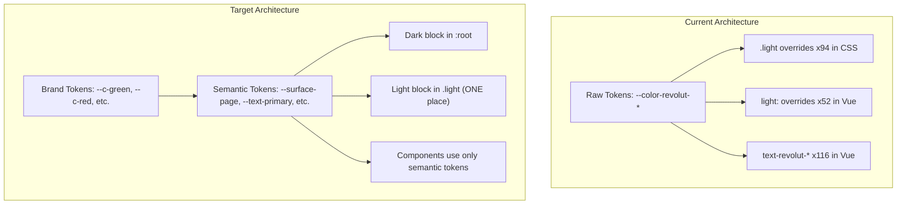

# Chiaro Design System Rework

## Problem Summary

The current CSS architecture has 94 `.light` selectors in CSS files and 52 inline `light:` overrides
in Vue templates, plus 116 inline `text-revolut-*` Tailwind classes. Every component manages its own
theme switching, making inconsistency inevitable. The light palette values are too close together
(0.944-0.997 lightness range for surfaces), causing the persistent "muddy/dull" complaints. Layout
CSS is 1249 lines of page-specific classes. The settings page still uses `app-grid-2` which creates
a 3-column layout (sidebar + 2 in main content).

## Architecture: Before vs After




---

## Phase 1: Token Rename + Semantic Layer

### 1A. Rename brand tokens in [tokens.css](app/assets/css/layers/tokens.css)

Rename all `--color-revolut-*` to `--c-*` (short prefix, Chiaro-owned). These are raw brand values
-- they stay the same colors, just renamed:

```css
@theme {
    --c-black: oklch(0.18 0.024 172);
    --c-dark: oklch(0.22 0.03 172);
    --c-card: oklch(0.27 0.037 170);
    --c-border: oklch(0.39 0.043 170);
    --c-text: oklch(0.95 0.012 95);
    --c-muted: oklch(0.75 0.017 170);
    --c-green: oklch(0.66 0.118 164);
    /* ... etc */
}
```

### 1B. Add semantic tokens below brand tokens in [tokens.css](app/assets/css/layers/tokens.css)

These are the tokens all components will use. The `.light` block here is the ONLY place theme
switching happens:

```css
:root {
    --surface-page: var(--c-black);
    --surface-card: var(--c-card);
    --surface-elevated: /* slightly lighter than card */;
    --surface-inset: /* slightly darker, for nested areas */;
    --text-primary: var(--c-text);
    --text-secondary: var(--c-muted);
    --border-default: var(--c-border);
    --border-subtle: /* lower opacity variant */;
    --accent: var(--c-green);
    --accent-text: var(--c-green);
    --danger: var(--c-red);
    --danger-text: var(--c-red);
    --warning: var(--c-amber);
    --info: var(--c-blue);
    /* gradients, shadows stay in :root */
}
.light {
    --surface-page: oklch(0.97 0.006 155); /* warmer, clearly distinct */
    --surface-card: oklch(0.995 0.003 155); /* white-ish */
    --surface-elevated: #fff; /* pure white for elevated */
    --surface-inset: oklch(0.94 0.01 155); /* visible step down */
    --text-primary: oklch(0.22 0.024 170);
    --text-secondary: oklch(0.44 0.02 168); /* was 0.42, bump contrast */
    --border-default: oklch(0.82 0.012 160); /* was 0.84 -- more visible */
    --border-subtle: oklch(0.88 0.008 160);
    --accent-text: var(--c-green-dark);
    --danger-text: var(--c-red-dark);
    /* hero gradient: brighter, less muddy */
}
```

Key difference from current light palette: surface levels are spaced ~0.025-0.055 apart in lightness
instead of ~0.01-0.02. This fixes the "everything looks the same" problem.

### 1C. Rebuild light hero gradient

The current `--app-gradient-hero-light` uses oklch values at 0.86-0.9 lightness with very low
chroma, producing a washed look. Replace with a cleaner, slightly more saturated variant that still
feels calm.

---

## Phase 2: Eliminate `.light` Overrides

### 2A. CSS files: replace all 94 `.light` selectors

Go through each CSS layer file and replace every
`.light .some-class { color: var(--color-revolut-light-*) }` with a single rule using semantic
tokens.

**Example -- current** ([surfaces.css](app/assets/css/layers/surfaces.css) lines 13-22):

```css
.ui-surface {
    background: ...;
    border: 1px solid var(--color-revolut-border);
}
.light .ui-surface {
    background: ...;
    border-color: var(--color-revolut-light-border);
}
```

**After:**

```css
.ui-surface {
    background: var(--surface-card);
    border: 1px solid var(--border-default);
}
```

No `.light` rule needed -- `--surface-card` and `--border-default` already switch in the semantic
layer.

Files to update (in order):

- [base.css](app/assets/css/layers/base.css) -- 4 `.light` selectors
- [layout.css](app/assets/css/layers/layout.css) -- 38 `.light` selectors
- [surfaces.css](app/assets/css/layers/surfaces.css) -- 29 `.light` selectors
- [forms.css](app/assets/css/layers/forms.css) -- 22 `.light` selectors

### 2B. Vue templates: replace all 52 `light:` and 116 `text-revolut-*` inline classes

Every `text-revolut-text light:text-revolut-light-text` becomes `text-[var(--text-primary)]` or a
utility class like `text-primary`. Every `text-revolut-muted light:text-revolut-light-muted` becomes
`text-[var(--text-secondary)]`. Color accent classes like
`text-revolut-green light:text-revolut-green-dark` become `text-[var(--accent-text)]`.

Files to update:

- [index.vue](app/pages/index.vue) -- 16 `text-revolut-*`, 7 `light:`
- [annual.vue](app/pages/annual.vue) -- 44 `text-revolut-*`, 21 `light:`
- [month.vue](app/pages/month.vue) -- 22 `text-revolut-*`, 10 `light:`
- [settings.vue](app/pages/settings.vue) -- 13 `text-revolut-*`, 5 `light:`
- [login.vue](app/pages/login.vue) -- 12 `text-revolut-*`, 5 `light:`
- [StatCard.vue](app/components/StatCard.vue) -- 2 + 1
- [InvoiceDetailsModal.vue](app/components/InvoiceDetailsModal.vue) -- 6 + 3
- [StateBlock.vue](app/components/StateBlock.vue) -- 2
- [IncomeProjectionCard.vue](app/components/IncomeProjectionCard.vue) -- 1
- [useUiStyles.ts](app/composables/useUiStyles.ts) -- inline Tailwind using `revolut-*` and `light:`

---

## Phase 3: Layout Simplification

### 3A. Fix settings page 3-column layout

In [settings.vue](app/pages/settings.vue), the top section at line 3 uses `app-grid-2` which on
desktop creates 2 columns in main content (making it effectively 3 columns with sidebar). The
payments section at line 169 does the same.

**Fix:** Replace `app-grid-2` with vertical stacking (same treatment already applied to other
pages). The gradient hero card and profile card stack vertically. The recurring/onetime payment
sections also stack vertically:

```html
<!-- Line 3: was <div class="app-grid-2 items-start"> -->
<div class="app-main-stack">
    <!-- Line 169: was <div class="app-grid-2 items-start"> -->
    <div class="app-main-stack"></div>
</div>
```

### 3B. Fix annual page `app-annual-split`

In [annual.vue](app/pages/annual.vue) line 89, `app-annual-split` still uses a 2-column grid at
`768px+` via `app-annual-split` in layout.css. Stack this vertically too.

### 3C. Consolidate page-specific layout classes in [layout.css](app/assets/css/layers/layout.css)

Reduce the 1249 lines by:

- Removing duplicate/overlapping classes (e.g., `app-settings-grid`, `app-settings-grid-single`,
`app-settings-stack` all do the same thing)
- Keeping only composable primitives: `app-main-stack`, `app-grid-2`, `app-grid-3` (for stat card
grids only)
- Moving truly page-specific layout into scoped `<style>` blocks in the respective page components
(annual donut layout, deadline rows, month bar rows)

Target: layout.css goes from ~1249 lines to ~600-700 lines.

---

## Phase 4: Sidebar Cleanup

### 4A. Simplify sidebar content in [app.vue](app/app.vue)

**Remove:** The `app-sidebar__note` paragraph (lines 25-27) and the footer copy paragraph (lines
51-53). These are marketing copy that belongs in onboarding or a tooltip, not permanent sidebar real
estate.

**Keep:** Brand mark, title, pill badge, nav links, theme toggle, fiscal year indicator (as a small
label, not a sentence).

**Result:** The sidebar becomes tighter, more navigation-focused, and better proportioned at
16-18rem width.

---

## Phase 5: Build Verification

### 5A. Run `npm run build`

The previous session skipped the build. Must verify no breakage from all the CSS changes.

### 5B. Visual QA

Spot-check all 5 pages (home, month, annual, settings, login) in both dark and light mode at desktop
and mobile widths using the browser tool.

---

## Files Changed (Summary)

CSS layer files (6):

- `app/assets/css/layers/tokens.css` -- renamed tokens, semantic layer, light palette
- `app/assets/css/layers/base.css` -- semantic token usage, remove `.light` selectors
- `app/assets/css/layers/layout.css` -- consolidate, remove page-specific bloat, remove `.light`
selectors
- `app/assets/css/layers/surfaces.css` -- semantic token usage, remove `.light` selectors
- `app/assets/css/layers/forms.css` -- semantic token usage, remove `.light` selectors
- `app/assets/css/layers/utilities.css` -- minor: update any `revolut-` refs

Vue page files (5):

- `app/pages/index.vue` -- remove inline `light:` and `text-revolut-`
- `app/pages/month.vue` -- same
- `app/pages/annual.vue` -- same, fix `app-annual-split`
- `app/pages/settings.vue` -- same, fix 3-column to stacked
- `app/pages/login.vue` -- same

Vue component files (5-6):

- `app/components/StatCard.vue`
- `app/components/InvoiceDetailsModal.vue`
- `app/components/StateBlock.vue`
- `app/components/IncomeProjectionCard.vue`
- `app/components/SurfaceCard.vue` (no change likely, just verify)
- `app/composables/useUiStyles.ts` -- update Tailwind class refs

Shell file (1):

- `app/app.vue` -- sidebar cleanup, remove inline theme classes

Config (1):

- `app/app.config.ts` -- potentially adjust Nuxt UI primary/neutral to align with new tokens

